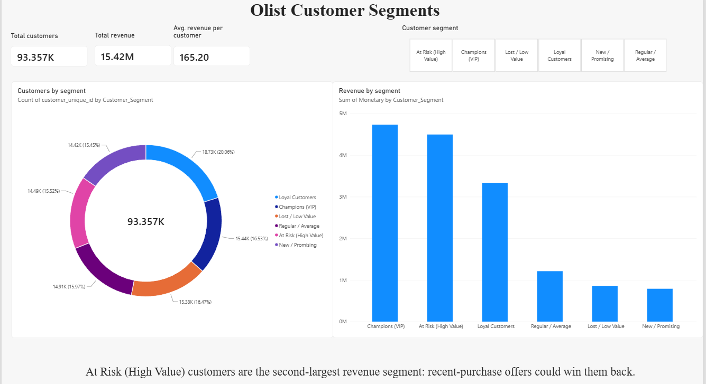

# E-Commerce Customer Segmentation & Retention Analysis for Olist Marketplace

## Project Overview
This project is an end-to-end data analytics solution using a real-world e-commerce dataset (Olist). The goal is to process raw data, perform customer segmentation, and build an interactive dashboard to drive business decisions.

## Tech Stack & Workflow
* **Phase 1: Data Cleaning & Modeling (SQL)** - Extracting and transforming raw CSV data into a structured format.
* **Phase 2: Customer Segmentation (Python/Pandas)** - Applying RFM (Recency, Frequency, Monetary) analysis to identify key customer groups.
* **Phase 3: Data Visualization (Power BI)** - Creating an interactive dashboard for management.

## Business Scenarios & Analysis Tasks

**Task 1: Data Cleaning and Consolidated View**
* **Business Scenario:** The company receives fragmented data from various departments (Logistics, Sales, Customer Service). Before any advanced analysis can be performed, management requires a single "Source of Truth" table.
* **Objective:** Join Orders, Customers, and Payments tables. Filter for 'delivered' status and valid payment amounts (>0) to ensure reports are based on real transactions.
* **Solution:** `01_data_cleaning_and_join.sql`

**Task 2: Top 10 Cities for Marketing Budget Allocation**
* **Business Scenario:** The Marketing Department is planning a digital ad campaign and needs to avoid blind spending. They want to target the regions that generate the highest revenue.
* **Objective:** Identify the top 10 cities based on total revenue (payment_value) from successfully delivered orders.
* **Solution:** `02_top_10_cities_revenue.sql`

**Task 3: Payment Type Analysis**

* **Business Scenario:** The Finance Department wants to renegotiate commission rates with payment providers (banks, credit card companies, boleto). To have strong leverage in negotiations, they need to understand the distribution of payment methods.
* **Objective:** Determine the total number of transactions and total revenue generated by each payment type for all successfully delivered orders. Order the results by highest revenue first.
* **Solution:** `03_payment_type_analysis.sql`

**Task 4: RFM Customer Segmentation (Python/Pandas)**

* **Business Scenario:** The Marketing team is currently running generic campaigns for all customers, resulting in low ROI and wasted budget. They need to understand customer behavior to send targeted, personalized offers rather than a "one-size-fits-all" approach.
* **Objective:** Perform RFM (Recency, Frequency, Monetary) analysis using Python and Pandas to categorize the customer base into actionable segments (e.g., Champions, Loyal Customers, At Risk) based on their purchasing history.
* **Solution:** `04_rfm_customer_segmentation.ipynb`

**Task 5: Interactive RFM Dashboard (Power BI)**

* **Business Scenario:** Executive management needs a quick, visual way to understand customer segments and their financial impact without looking at raw data or Python code.
* **Objective:** Connect the segmented data to Power BI and build a dashboard highlighting customer distribution (Donut Chart) and revenue generation by segment (Clustered Column Chart).
* **Solution:** `05_RFM_Dashboard.pbix` (Interactive file) and `RFM_Dashboard_Preview.png` (Visual preview)

Task 6: Advanced ML & Retention Analysis (Python)

- K-Means clustering and cohort retention heatmap: 06_advanced_ml_and_churn.ipynb
- Repurchase prediction with time-based split (no data leakage): 07_churn_prediction_time_based.ipynb

Key findings:
- High-value one-timers are 30% of customers but generate 57.5% of revenue.
  Only 3% of customers buy more than once.
- Less than 1% of customers order again in the month after their first purchase
  (cohort retention heatmap).
- Only 0.7% of customers (386 of 55,524) placed another order within 90 days.
- Logistic Regression (ROC-AUC 0.61, PR-AUC 0.05, about 7x the random baseline of 0.007)
  outperformed Random Forest (PR-AUC 0.011) at ranking likely repurchasers.
- RFM features alone carry weak signal. Next step: add delivery delay and review score.

## Data & how to reproduce
Dataset: Olist Brazilian E-Commerce (Kaggle). Run the SQL in 01_data_cleaning_and_join.sql,
export the result as rfm_data.csv, then run the notebooks in order (04, 06, 07).

